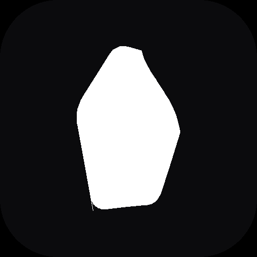

# LifeQuest ⚔️

Turn your real life into an RPG. Build habits, complete quests, and level up your character while becoming a stronger, sharper, healthier version of yourself in the real world.



## Quick Start

```bash
npm install
npm run dev
```

Open **http://localhost:5173** — that's it. No configuration required.

LifeQuest runs in **Demo Mode** out of the box: your account and all progress are stored locally in your browser (`localStorage`), so you can install and play immediately. To enable real cloud accounts and cross-device sync, see [Connecting Supabase](#connecting-supabase-optional) below.

## Scripts

| Command | Description |
|---|---|
| `npm run dev` | Start the local dev server with hot reload |
| `npm run build` | Production build to `dist/` |
| `npm run preview` | Preview the production build locally |
| `npm run lint` | Run oxlint |

## Features

- **Habit System** — unlimited habits with categories, icons, colors, XP values, priority, daily/weekly/monthly recurrence, pause/archive/delete
- **RPG Progression** — XP, levels, 8 life attributes (Intelligence, Strength, Vitality, Wisdom, Finance, Creativity, Discipline, Spiritual Growth), coins, streaks
- **Daily Quests & Weekly Challenges** — auto-generated, rotate on schedule
- **Long-Term Life Quests** — link habits to big goals ("Learn Machine Learning", "Run a Marathon") and watch progress accrue automatically
- **Achievements** — 18 achievements including hidden ones, plus unlockable titles
- **Analytics** — GitHub-style yearly heatmap, completion trend charts, life-attribute radar chart, category breakdown, productivity score
- **Guild Master** — a rule-based AI coach that reads your habit data and produces weekly/monthly reports: strengths, weaknesses, suggestions, motivation, and predictions — 100% local, no external API calls
- **Cosmetics** — unlockable avatars and themes tied to level
- **Settings** — dark/light mode, sound effects, animation toggle, CSV export, PDF export, full JSON backup & restore
- **PWA** — installable, offline-capable, with a real app icon and service worker

## Tech Stack

React 19 · Vite · Tailwind CSS v3 · Framer Motion · Recharts · React Router · Zustand · Supabase (optional) · vite-plugin-pwa

## Project Structure

```
src/
  components/
    common/        Modal, Toast, LevelUpModal, EmptyState, ProgressRing...
    layout/         Sidebar, Topbar, MobileNav, AppLayout
    habits/         HabitCard, HabitForm
    quests/         LifeQuestCard, LifeQuestForm
    dashboard/      AttributeBar, DailyQuestPanel, WeekStrip, RecentActivity
    analytics/      YearHeatmap, AttributeRadar, CompletionTrendChart, StatSummaryCard
  pages/            One file per route (Dashboard, Habits, Quests, Achievements,
                    Analytics, GuildMaster, Profile, Settings, Landing, Login, ...)
  store/            Zustand stores — authStore, gameStore, uiStore
  services/         supabase.js (client), localAuth.js (demo-mode auth fallback)
  hooks/            useConfetti, useSound
  utils/            xp.js, dateHelpers.js, analytics.js, guildMaster.js, constants.js...
  styles/           index.css (design system + Tailwind layers)
supabase/
  schema.sql        Run this in your Supabase project to enable cloud sync
```

## How the data layer works

LifeQuest is **local-first**: all game state (habits, completions, XP, quests, achievements) lives in a Zustand store that persists to `localStorage`, namespaced per user. This is why the app works immediately with zero setup.

If you connect a Supabase project (see below), the same store also debounced-syncs your full state as a JSON snapshot to a `user_data` table, so your progress follows you across devices. The local copy always remains the source of truth for the current session — sync is best-effort and non-blocking.

## Connecting Supabase (optional)

By default LifeQuest uses **Demo Mode**: a lightweight local auth system that mimics Supabase's API so the rest of the app doesn't need to know which backend is active. To switch to real accounts:

1. Create a free project at [supabase.com](https://supabase.com).
2. In your Supabase project, go to **SQL Editor → New query**, paste the contents of `supabase/schema.sql`, and run it. This creates the `user_data` table with row-level security so users can only ever read/write their own data.
3. Go to **Project Settings → API** and copy your **Project URL** and **anon public key**.
4. Copy `.env.example` to `.env` and fill in both values:
   ```
   VITE_SUPABASE_URL=https://your-project.supabase.co
   VITE_SUPABASE_ANON_KEY=your-anon-key
   ```
5. In your Supabase project, go to **Authentication → Providers** and make sure **Email** is enabled. For password reset emails to work, configure your **Site URL** and **Redirect URLs** under **Authentication → URL Configuration**.
6. Restart `npm run dev`. LifeQuest will detect the env vars automatically and switch from Demo Mode to real Supabase auth — no code changes needed.

## PWA / Installing on your phone

Run `npm run build && npm run preview`, open the preview URL on your phone (same network), and use "Add to Home Screen" (iOS Safari) or the install prompt (Android Chrome). The app will work offline after the first load thanks to the generated service worker.

## Customizing the look

The entire visual language lives in two places:

- `tailwind.config.js` — color palette (navy, electric purple, cyan, magenta), fonts, shadows, animations
- `src/styles/index.css` — reusable component classes (`.glass-panel`, `.btn-primary`, `.xp-bar-fill`, etc.) and the light-mode override block

Change the palette in one place and it propagates everywhere.

## License

MIT — see `LICENSE`.
